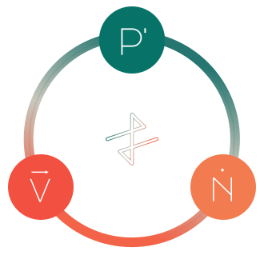

<h1 align="center">Apex Fusion Reactor - Test Suit</h1>

<p align="center"></p>


An automated testing suite for the **Apex Fusion Reactor** website, 
developed with **Selenium** and utilizing Chrome, 
is designed to thoroughly test every interaction and feature, 
including support for **MetaMask** and **Eternl** wallets. 
This tool mimics user behavior and checks responses to guarantee optimal performance and reliability. 
By addressing **all possible scenarios**, this tool provides a strong foundation for identifying and fixing potential issues in the website's functionality and user interface.

## Installation

1. Clone the repository:

   ```bash
   git clone https://github.com/bane/apex-fusion-reactor-test-suite.git
   cd apex-fusion-reactor-test-suite
   ```

2. Set up a virtual environment (recommended):

   ```bash
   python -m venv venv
   source venv/bin/activate
   ```

3. Install the required packages:

   ```bash
   pip install -r requirements.txt
   ```

## Configuration

1. Copy the example configuration file:

   ```bash
   cp environment.env.example environment.env
   ```

2. Open `environment.env` and set environment variables:

   ```
    SIGN_KEY=
    PRIME_WALLET_RECOVERY_PHRASE=
    VECTOR_WALLET_RECOVERY_PHRASE=
    NEXUS_WALLET_RECOVERY_PHRASE=
    NEXUS_NETWORK_NAME=
    NEXUS_NETWORK_RPC_URL=
    NEXUS_NETWORK_CHAIN_ID=
    NEXUS_NETWORK_CURRENCY_SYMBOL=
    APEX_FUSION_REACTOR_URL=
    APEX_FUSION_FAUCET_URL=
   ```

## Usage Examples

1. **Prime to Vector**

   ```bash
   dotenv -f environment.env run -- python main.py Prime Vector 5
   ```

2. **Prime to Nexus**

   ```bash
   dotenv -f environment.env run -- python main.py Prime Nexus 5
   ```

3. **Vector to Prime**

   ```bash
   dotenv -f environment.env run -- python main.py Vector Prime 2
   ```
  
4. **Nexus to Prime**

   ```bash
   dotenv -f environment.env run -- python main.py Nexus Prime 2
   ```
