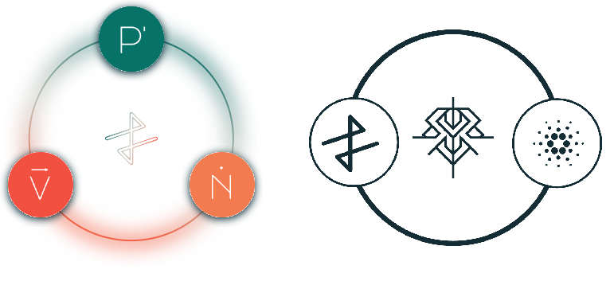

<h1 align="center">BRIDGE WEB TEST SUITE</h1>

<p align="center">
   
</p>


An automated testing suite for the **Reactor Bridge** and **Skyline Bridge** websites, 
developed with **Selenium** and utilizing Chrome, 
is designed to thoroughly test every interaction and feature, 
including support for **MetaMask** and **Eternl** wallets. 
This tool mimics user behavior and checks responses to guarantee optimal performance and reliability. 
By addressing **all possible scenarios**, this tool provides a strong foundation for identifying and fixing potential issues in the website's functionality and user interface.

## Installation

1. Clone the repository:

   ```bash
   git clone https://github.com/Ethernal-Tech/bridge-web-test-suite.git
   cd bridge-web-test-suite
   ```

2. Set up a virtual environment (recommended):

   ```bash
   python -m venv venv
   source venv/bin/activate
   ```

3. Install the required packages:

   ```bash
   pip install -r requirements.txt
   ```

## Configuration

1. Copy the example configuration file:

   ```bash
   cp environment.env.example environment.env
   ```

2. Open `environment.env` and set environment variables:

   ```
   CHROME_CONFIGS_URL=''
   CHROMEDRIVER_VERSION=''
   BRIDGE_URL=''
   SIGN_KEY=''
   APEX_FUSION_FAUCET_URL=''
   PREVIEW_FAUCET_API_KEY=''
   PREPROD_FAUCET_API_KEY=''
   BRD_PROXY_USERNAME=''
   BRD_PROXY_PASSWORD=''
   CARDANO_TESTNET_WALLETS=''
   ```

## Usage Examples

### Reactor

1. **Prime to Nexus**

   ```bash
   dotenv -f environment.env run -- python main.py Reactor Prime 5 AP3X Nexus
   ```
 
2. **Nexus to Prime**

   ```bash
   dotenv -f environment.env run -- python main.py Reactor Nexus 5 AP3X Prime
   ```

### Skyline

1. **Prime (AP3X) to Preview (cAP3X)**

   ```bash
   dotenv -f environment.env run -- python main.py Skyline Prime 5 AP3X Preview
   ```

2. **Preview (cAP3X) to Prime (AP3X)**

   ```bash
   dotenv -f environment.env run -- python main.py Skyline Preview 5 cAP3X Prime
   ```
